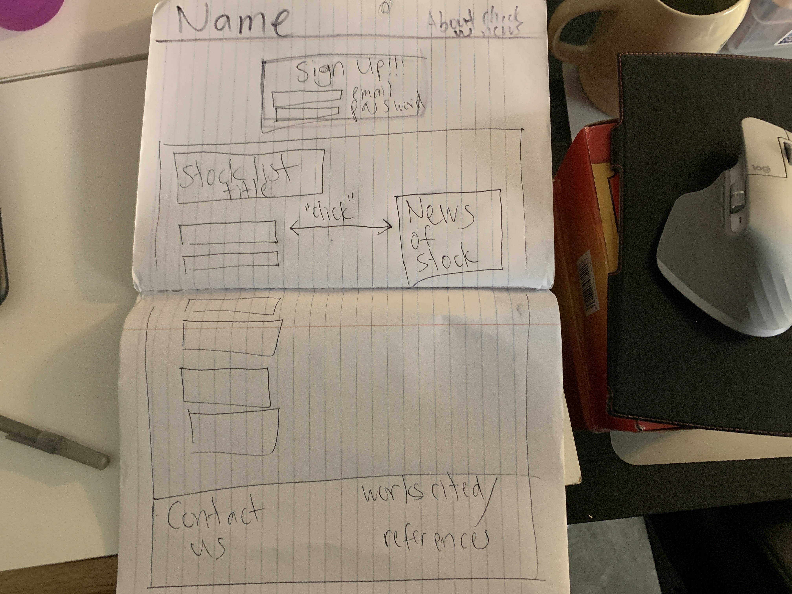

# Stocks Look Up

## Description

This webpage dynamically displays a list of stocks and the current news of a selected stock. The user will be able to login with their credentials, so that they can save a stock to their favorites list and quickly view it whenever they are logged in. The webpage is responsive to all screen sizes and has a dark theme mode.

## User Story

- As a day trader, I want to look up and view information about a stock's price and its current news.

- As a user, I want to save selected stocks in my profile so that I can quickly view them in my favorites list whenever I login with my email and password.

## Acceptance Criteria

- It's done when I can view the stocks I previously saved as soon as I login again.

- It's done when the webpage displays a list of stocks, and, upon clicking on a stock, a new display element appears and the text content shows the current news about selected stock.

## <a href="">Link to Application</a>

## APIs

1. yahoo finance
2. alpha advantage

## Wireframe

